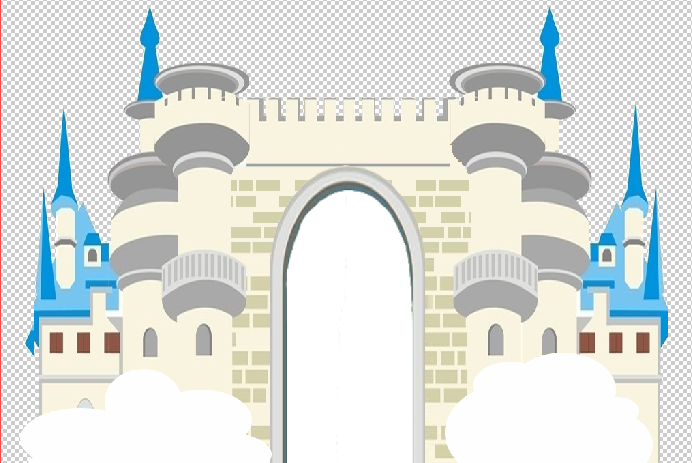

## 城堡主体

文件：城堡.psd

比例尺1:10（切换到厘米模式，图上1cm=打印10cm）

## 调整门

城门是独立图层，调成门到合适大小后，再与城堡主体合并图层，再删除门中白色部分。

## 配件（需额外打印/制作）

1. 招牌布景 kt板正面打印为酒店名，背面手写“拆”。

 

2. 云朵布景 纸板贴白纸或买空白kt板切出。

## 城堡切换模式

1. 酒店模式：招牌布景正面向观众

2. 废弃模式：招牌布景背面向观众

3. 音乐剧模式： 把招牌换成云朵布景

