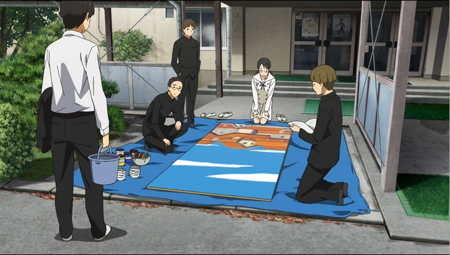

- 概述

动画时长：1:19:00~1:19:45，对应我们剧本的第六幕。舞台上是成濑独白音乐剧进度，而此时幻灯片可以模仿动画，播放若干个展现全班准备音乐剧的短镜头。

- 操作

各位演员穿着校服，但是不戴假发。然后模仿每个场景的站位动作，拍摄照片。

- 效果

在第六幕演出中展现给观众的效果是：舞台上各位主角与配角在准备音乐剧，幻灯片里是一些没有名字的同学也在参与准备音乐剧。所以不能在照片里装扮成剧本里的角色，而是扮演的是班级里其余的同学，故不带假发。

另外，这也是一个融在正片里的花絮：记录了各位在台下排练老人剧的片段。这也是不需要戴假发，真人出镜的原因。

- 举例
  
  动画里这一段有一个场景是同学们在准备幕布，等我们的幕布到了我们也模仿这个拍摄角度/站位/穿着校服拍一张，做进第六幕的幻灯片。

  

- 能做多少？

1. 负责剪视频的人先用动画截图做好整个幻灯片。
2. 问组织部交视频的ddl，根据ddl分配每一张照片的拍摄时间和人员。例如明天幕布送到，约几个有空的人穿着校服，验收幕布的时候就把“准备幕布”这一张照片拍了。
3. 若第2步确实没时间做，跳过第4步，交动画截图版本。
4. 负责剪视频的人用照片替换动画截图。
  

