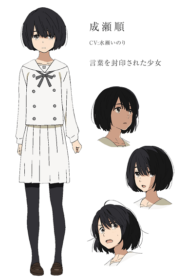
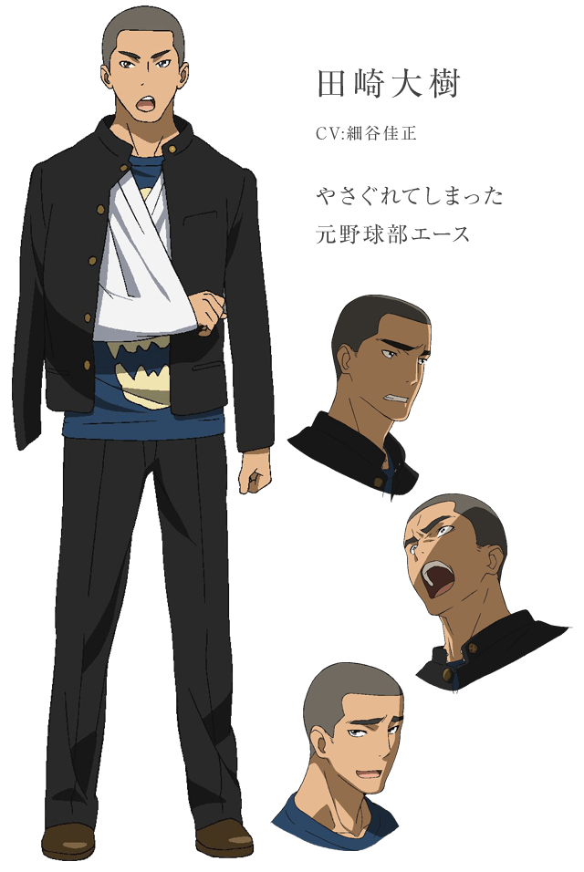
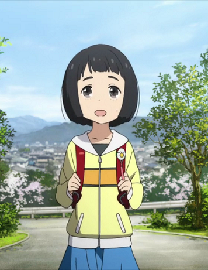
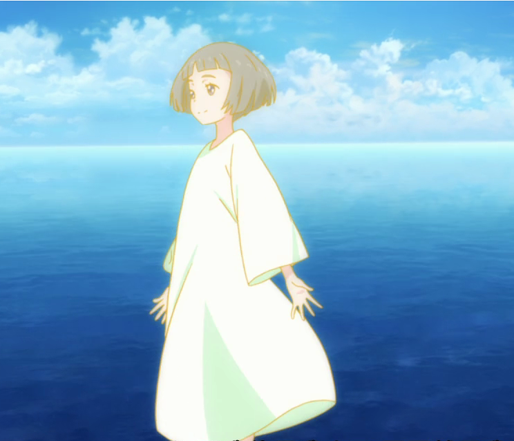
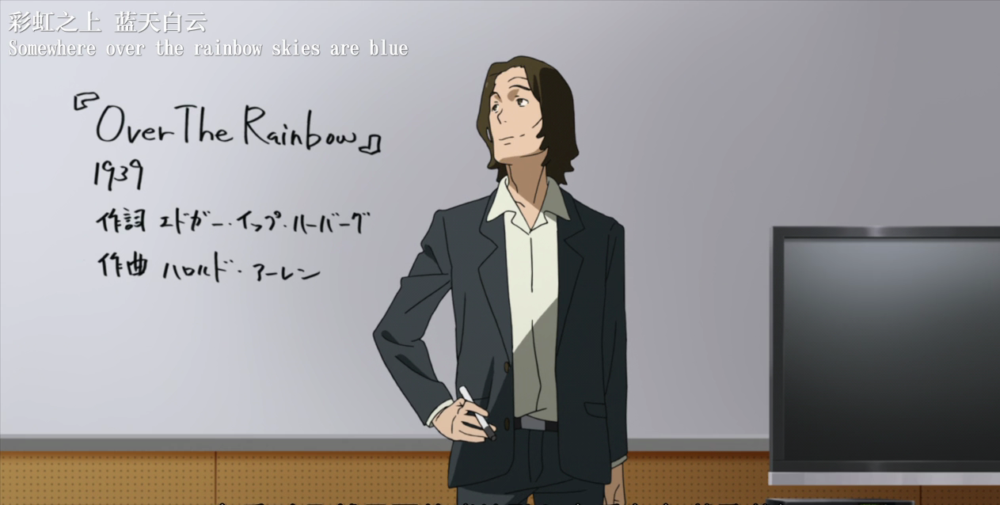
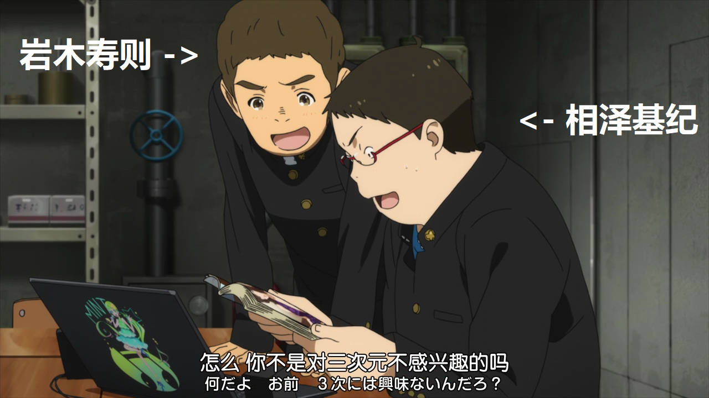
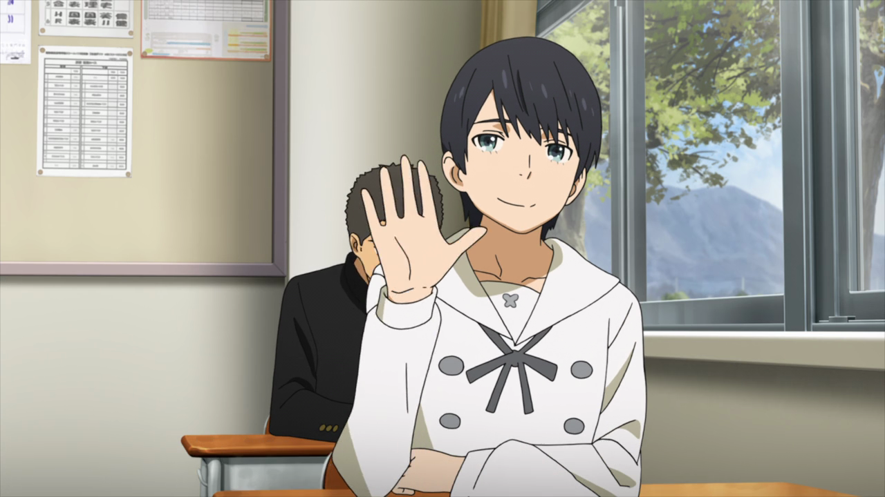
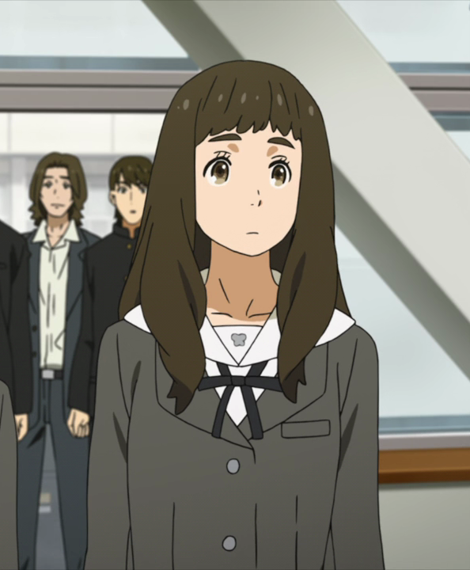
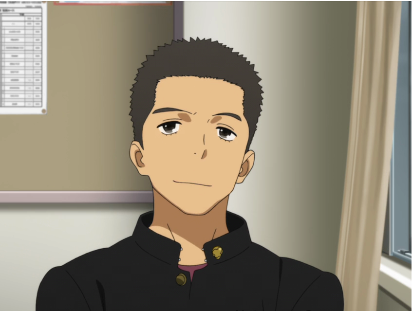

# 主要角色
## 成濑顺  
第一女主角。是2班学生。  

 
 
 
 
## 坂上拓实
第一男主角。是2班学生。  

 
 
 

## 仁藤菜月 
第二女主角。是2班学生。  

 
 
 

## 田崎大树
第二男主角。是2班学生。  

 
 
 

## 成濑顺（幼年）
幼年时期的成濑顺。  

 
 
 

## 成濑顺（内心） 
成濑顺内心中的自己。  

 
 
 

## 蛋人  
成濑顺想象中的怪人。  
### _形象待定_  
  
 
 
 

---------------------  
  
# 次要角色
## 老师   
2班班主任及音乐老师。  

 
 
 

## 相泽基纪 岩木寿则
坂上拓实朋友。掌握语音合成技术。是2班学生。  

 
 
 

## 江田明日香
仁藤菜月朋友。是2班学生。  

 
 
 

## 宇野阳子
仁藤菜月朋友。是2班学生。  

 
 
 

## 三岛树
田崎大树朋友。是2班学生。  

 
 
 

## 成濑顺的父亲  
### _形象暂不指定_  

 
 
 

## 成濑顺的母亲
### _形象暂不指定_  

 
 
 

## 成濑顺的父亲的情人  
### _形象暂不指定_  

 
 
 

  
# 后勤与幕布
后勤、幕布需要若干名